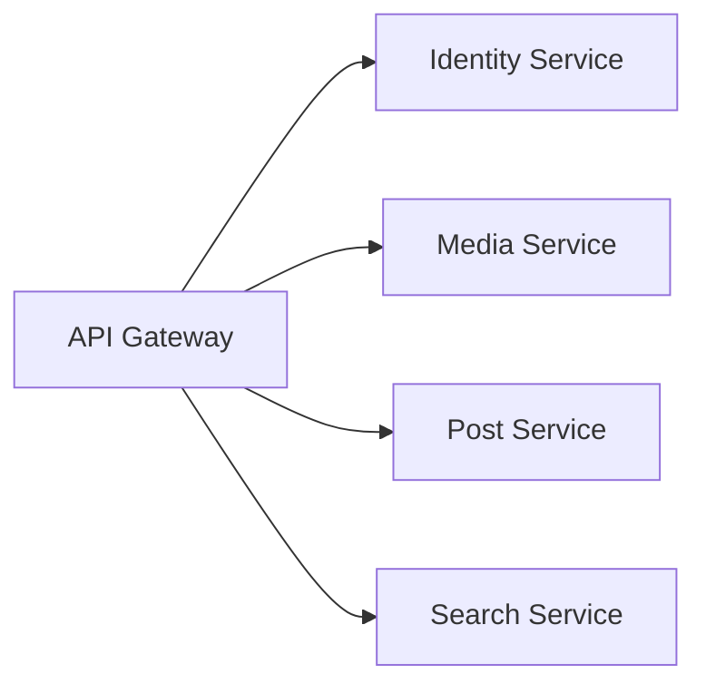

<p align="center">
  
</p>


<p align="center">
  
</p>

# Node.js Microservices Workspace


---


---

## Screenshots & Diagrams

<details>
<summary>Click to expand</summary>

**Folder Structure Example:**

```text
nodejs-microservices/
├── bookstore-api/
├── concepts/
├── ejs/
├── express/
├── express-concepts/
├── mongodb-basics/
├── mongodb-intermediate/
├── node-concepts/
├── nodejs-auth/
├── nodejs-socket/
├── nodejs-with-typescript/
├── redis/
├── rest-api-development/
└── social-media-microservices/
```

**Microservices Architecture Diagram:**



</details>

---

## Getting Started (Quickstart)

1. **Clone the repository:**
  ```bash
  git clone https://github.com/yourusername/nodejs-microservices.git
  cd nodejs-microservices
  ```
2. **Install dependencies:**
  ```bash
  cd bookstore-api # or any project folder
  npm install
  ```
3. **Run a project:**
  ```bash
  node server.js
  # or
  npm start
  ```
4. **Test endpoints:**
  Use Postman or curl to interact with the API.

---

This workspace is a comprehensive collection of Node.js projects, microservices, and concept demos. It is designed for learning, experimenting, and building scalable backend systems using Node.js, Express, MongoDB, Redis, EJS, TypeScript, and more. The structure supports both beginners and advanced users, with real-world examples and best practices.

---


## Table of Contents

- [Project Overview](#project-overview)
- [How to Use](#how-to-use)
- [Folder Explanations](#folder-explanations)
  - [bookstore-api](#bookstore-api)
  - [concepts](#concepts)
  - [ejs](#ejs)
  - [express](#express)
  - [express-concepts](#express-concepts)
  - [mongodb-basics](#mongodb-basics)
  - [mongodb-intermediate](#mongodb-intermediate)
  - [node-concepts](#node-concepts)
  - [nodejs-auth](#nodejs-auth)
  - [nodejs-socket](#nodejs-socket)
  - [nodejs-with-typescript](#nodejs-with-typescript)
  - [redis](#redis)
  - [rest-api-development](#rest-api-development)
  - [social-media-microservices](#social-media-microservices)
- [Contribution Guidelines](#contribution-guidelines)
- [Troubleshooting & FAQ](#troubleshooting--faq)
- [Contact](#contact)
- [Resources](#resources)

---


---

## Folder Explanations

---


## bookstore-api/
A RESTful API for managing a bookstore. Includes controllers, models, routes, and a database connection.

**Key Files:**
- `server.js`: Starts the Express server.
- `controllers/book-controller.js`: Handles book logic (CRUD).
- `models/book.js`: Book schema/model.
- `routes/book-routes.js`: API endpoints for books.
- `database/db.js`: MongoDB connection setup.

**Example Usage:**
```bash
node server.js
```
**Sample API Calls:**
- `GET /books` — Returns all books
- `POST /books` — Adds a new book (send JSON body)

**Sample Controller Snippet:**
```js
// controllers/book-controller.js
exports.getBooks = (req, res) => {
  // Fetch books from DB
  res.json([...]);
};
```

## concepts/

Contains subfolders for learning and demonstrating core Node.js concepts:

- **1. hello-world-node/**
  - `index.js`: Prints "Hello, World!"
  - `sum.js`: Adds two numbers.
  - *Example:*
    ```js
    // index.js
    console.log('Hello, World!');
    ```

- **2. node-module-system/**
  - Demonstrates CommonJS module exports/imports.
  - *Example:*
    ```js
    // first-module.js
    module.exports = () => 'Exported!';
    ```

- **3. node-package-manager/**
  - Shows how to use npm and `package.json`.
  - *Example:*
    ```bash
    npm install lodash
    ```

- **4. path-module/**
  - Examples using Node's `path` module.
  - *Example:*
    ```js
    const path = require('path');
    console.log(path.basename(__filename));
    ```

- **5. file-system/**
  - File read/write operations.
  - *Example:*
    ```js
    const fs = require('fs');
    fs.writeFileSync('data.txt', 'Hello!');
    ```

- **6. http-module/**
  - Simple HTTP server and routing.
  - *Example:*
    ```js
    const http = require('http');
    http.createServer((req, res) => res.end('Hi')).listen(3000);
    ```

- **7. callbacks/**
  - Callback patterns and "callback hell".
  - *Example:*
    ```js
    fs.readFile('input.txt', (err, data) => {
      if (err) throw err;
      console.log(data.toString());
    });
    ```

- **8. promises/**
  - Using Promises for async code.
  - *Example:*
    ```js
    const readFile = require('fs').promises.readFile;
    readFile('input.txt').then(console.log);
    ```

- **9. async-await/**
  - Async/await syntax for asynchronous operations.
  - *Example:*
    ```js
    async function main() {
      const data = await readFile('input.txt');
      console.log(data.toString());
    }
    main();
    ```

- **10. event-emitter/**
  - Custom event emitters and listeners.
  - *Example:*
    ```js
    const EventEmitter = require('events');
    const emitter = new EventEmitter();
    emitter.on('greet', () => console.log('Hello!'));
    emitter.emit('greet');
    ```


## ejs/
Demo project for using EJS templating in Node.js.

**Key Files:**
- `index.js`: Express server rendering EJS views.
- `views/`: EJS templates (e.g., `home.ejs`, `about.ejs`).

**Example Usage:**
```js
// In a route handler
res.render('home', { title: 'Home Page' });
```
**Sample EJS Template:**
```ejs
<h1>Welcome, <%= user %>!</h1>
```


## express/
Examples and demos for Express.js, including middleware and routing.

**Key Files:**
- `index.js`: Basic Express app.
- `middleware.js`: Custom middleware examples.
- `routes-example.js`: Route handling demo.

**Sample Middleware:**
```js
function logger(req, res, next) {
  console.log(`${req.method} ${req.url}`);
  next();
}
```


## express-concepts/
Advanced Express.js concepts and best practices.

**Key Folders:**
- `middleware/`: Custom middleware (error handler, rate limiting, versioning).
- `routes/`: Example route files (e.g., `item-routes.js`).
- `config/`: Configuration files (e.g., `corsConfig.js`).

**Sample Error Handler:**
```js
// middleware/errorHandler.js
module.exports = (err, req, res, next) => {
  res.status(500).json({ error: err.message });
};
```


## mongodb-basics/
Basic MongoDB integration with Node.js.

**Key File:**
- `app.js`: Connects to MongoDB and performs CRUD operations.

**Sample Connection:**
```js
const mongoose = require('mongoose');
mongoose.connect('mongodb://localhost:27017/mydb');
```


## mongodb-intermediate/
Intermediate MongoDB usage, with controllers, models, and routes for books and products.

**Key Folders:**
- `controllers/`: Logic for books and products.
- `models/`: Mongoose schemas for `Book`, `Author`, `Product`.
- `routes/`: API endpoints for books and products.

**Sample Model:**
```js
// models/Book.js
const mongoose = require('mongoose');
const BookSchema = new mongoose.Schema({ title: String });
module.exports = mongoose.model('Book', BookSchema);
```


## node-concepts/
Demos for Node.js internals:
- `buffer-demo.js`: Buffer usage.
- `event-loop.js`: Event loop demonstration.
- `streams-demo.js`: Working with streams.

**Sample Buffer Usage:**
```js
const buf = Buffer.from('abc');
console.log(buf.toString('hex'));
```


## nodejs-auth/
Authentication microservice with user and image management.

**Key Folders:**
- `controllers/`: Auth and image controllers.
- `middleware/`: Auth, admin, and upload middleware.
- `models/`: User and image schemas.
- `uploads/`: Directory for uploaded files.

**Sample Auth Middleware:**
```js
// middleware/auth-middleware.js
module.exports = (req, res, next) => {
  // Check token logic
  next();
};
```


## nodejs-socket/
Socket.io demo for real-time communication.

**Key Files:**
- `server.js`: Socket.io server setup.
- `public/`: Static files for the client.

**Sample Socket.io Usage:**
```js
const io = require('socket.io')(3000);
io.on('connection', socket => {
  socket.emit('message', 'Welcome!');
});
```


## nodejs-with-typescript/
Node.js project using TypeScript.

**Key Files:**
- `src/`: TypeScript source files.
- `tsconfig.json`: TypeScript configuration.

**Sample TypeScript File:**
```ts
// src/index.ts
const greet = (name: string): string => `Hello, ${name}`;
```


## redis/
Demos for using Redis with Node.js.

**Key Files:**
- `data-structures.js`: Redis data structure examples.
- `pub-sub.js`: Publish/subscribe pattern.
- `io-redis.js`: Using the `ioredis` client.

**Sample Pub/Sub:**
```js
const Redis = require('ioredis');
const pub = new Redis();
const sub = new Redis();
sub.subscribe('news');
pub.publish('news', 'Hello Redis!');
```


## rest-api-development/
A simple REST API project for learning API development.

**Key File:**
- `app.js`: Main API server.

**Sample Route:**
```js
app.get('/api/items', (req, res) => res.json([]));
```


## social-media-microservices/
A microservices-based social media backend.

**Key Files/Folders:**
- `docker-compose.yml`: Orchestrates all services.
- `api-gateway/`: API gateway service.
- `identity-service/`, `media-service/`, `post-service/`, `search-service/`: Individual microservices for different features.

**How Services Connect:**
- Each service runs independently and communicates via HTTP or message queues.
- The API gateway routes requests to the correct service.

**Sample Docker Compose Service:**
```yaml
services:
  api-gateway:
    build: ./api-gateway
    ports:
      - "3000:3000"
```

---


---

## How to Use

1. **Install dependencies:**
  - Navigate to a project folder and run:
    ```bash
    npm install
    ```
2. **Run the project:**
  - Start the server (example):
    ```bash
    node server.js
    # or
    npm start
    ```
3. **Test endpoints:**
  - Use tools like Postman or curl to test API endpoints.
4. **Explore code:**
  - Review controllers, models, and routes to understand the flow.
5. **Experiment:**
  - Modify code and rerun to see changes in action.

---

---


---


---


---

## License

This project is licensed under the MIT License. See the [LICENSE](LICENSE) file for details.

---

## Changelog

- **v1.0.0** — Initial release with all core folders and documentation.
- **v1.1.0** — Enhanced README with examples, usage, and contribution guidelines.
- **v1.2.0** — Added troubleshooting, contact, and resource sections.
- **v1.3.0** — Added screenshots, diagrams, quickstart, and roadmap.

---

## Tests

Some projects include test files or can be tested manually:
- To run tests (if available):
  ```bash
  npm test
  # or
  node test.js
  ```
- For manual testing, use Postman/curl for API endpoints.

---

## Roadmap

- [ ] Add Dockerfiles for all services
- [ ] Add CI/CD pipeline examples
- [ ] Add more advanced TypeScript and testing demos
- [ ] Expand microservices with gRPC and message queues
- [ ] Add frontend integration examples

---

## Credits & Acknowledgments

- Inspired by the Node.js, Express, and MongoDB communities
- Thanks to all contributors and open-source maintainers
- Special thanks to [Node.js](https://nodejs.org/), [Express](https://expressjs.com/), [MongoDB](https://mongodb.com/), and [Redis](https://redis.io/)

We welcome contributions! To contribute:

1. Fork this repository.
2. Create a new branch for your feature or fix.
3. Make your changes and add tests/examples if needed.
4. Submit a pull request with a clear description.

**Code Style:**
- Use consistent formatting (Prettier/ESLint recommended).
- Write clear commit messages.
- Add comments for complex logic.

---

## Troubleshooting & FAQ

**Q: I get a module not found error?**
A: Run `npm install` in the relevant folder.

**Q: MongoDB/Redis connection fails?**
A: Ensure MongoDB/Redis is running locally or update the connection string in the config files.

**Q: Port already in use?**
A: Change the port in the server file or stop the conflicting process.

**Q: TypeScript errors?**
A: Run `tsc --noEmit` in the TypeScript project folder to see details.

**Q: How do I run multiple microservices?**
A: Use `docker-compose up` in the `social-media-microservices` folder.

---

## Contact

For questions, suggestions, or support:
- Open an issue on GitHub
- Email: your.email@example.com

---

## Resources

- [Node.js Documentation](https://nodejs.org/en/docs/)
- [Express.js Guide](https://expressjs.com/)
- [MongoDB Docs](https://docs.mongodb.com/)
- [Redis Docs](https://redis.io/documentation)
- [TypeScript Handbook](https://www.typescriptlang.org/docs/)
- [EJS Docs](https://ejs.co/)

---

**Happy Coding!**
